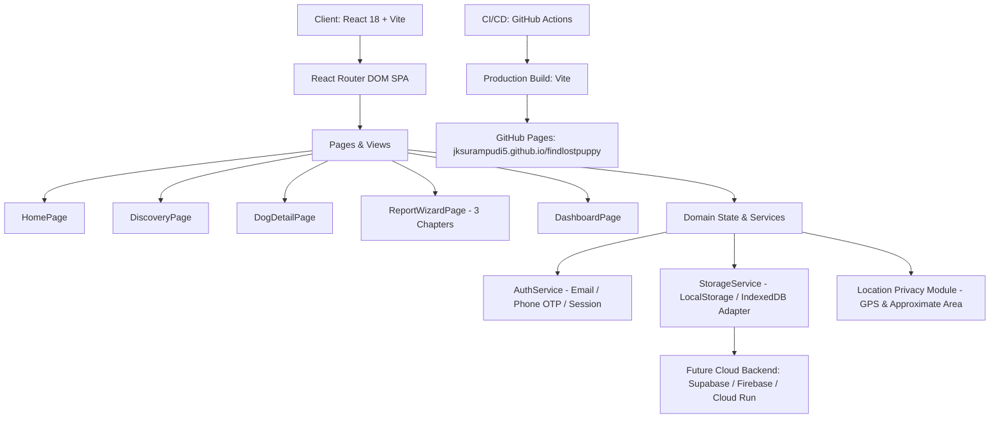

# Architecture — FindLostPuppy 🐾

## High-Level Architectural Overview

FindLostPuppy is designed as a modern, responsive, privacy-first web platform for reporting and identifying lost dogs and collecting community sightings.

## Core Principles

1. **Privacy Boundaries**:
   - Private data (exact street address, house/flat number, exact GPS meter coordinates, private phone numbers) is strictly partitioned from public representations.
   - Public representations display approximate regions (e.g. `Near Benz Circle, Vijayawada` or `Near Bio-Diversity Park, Gachibowli, Hyderabad`).

2. **2-Chapter Separation**:
   - Chapter 1: Owner Profile & Base Location.
   - Chapter 2: Pup Profile, Characteristics & Photos.
   - Chapter 3: Disappearance Event & Contact Preferences.

3. **Offline-First & Extensibility**:
   - Built on a repository service abstraction (`storageService.ts`), allowing seamless substitution of local storage with Supabase, Firebase, or GraphQL backend APIs without modifying UI components.
