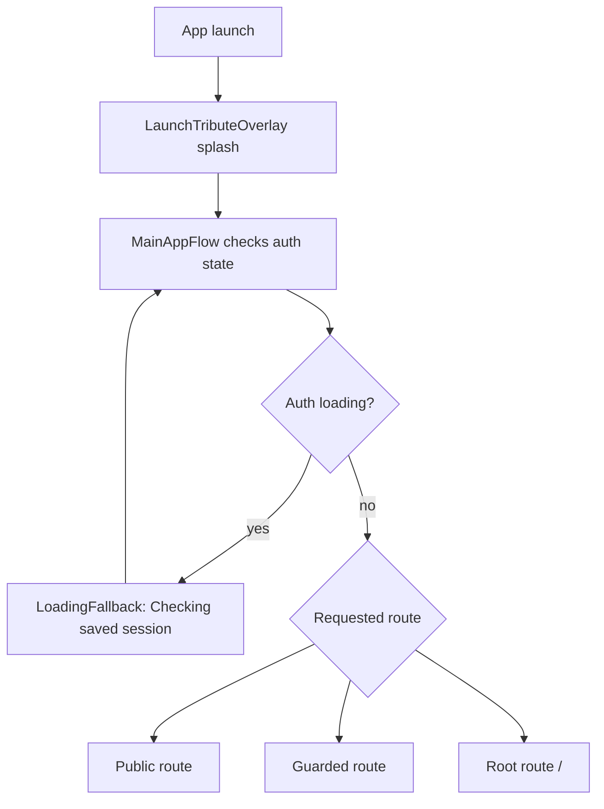
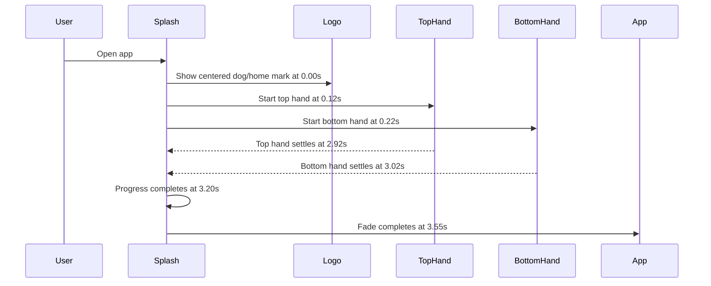
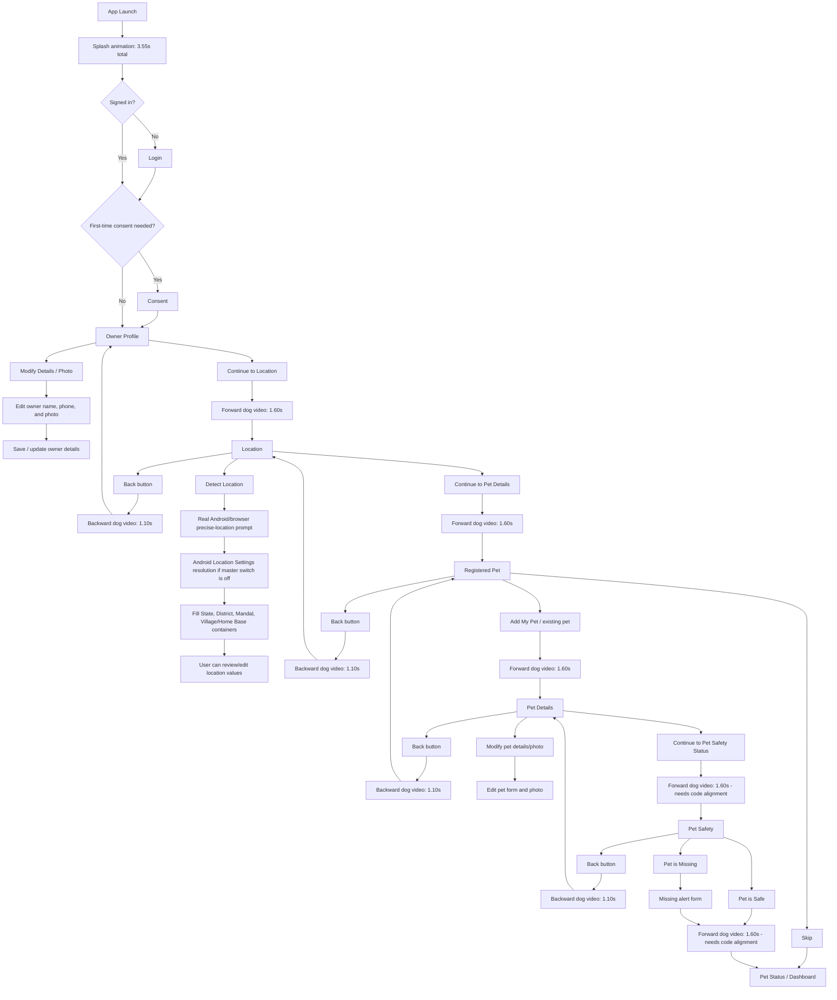
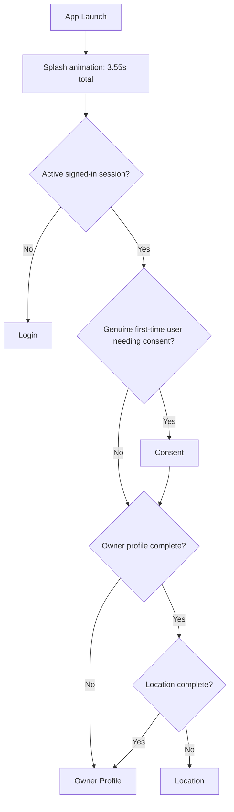
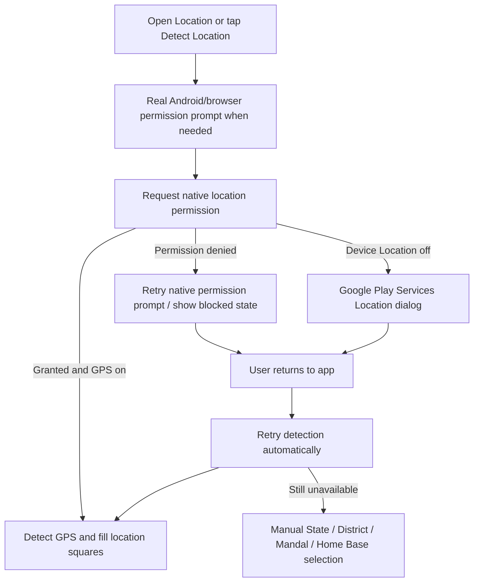

# Navigation Flow

This file maps how navigation works in the app today. The source of truth for route wiring is `src/App.tsx`; the page files below contain the button-level actions.

## Screen File Map

| Order | Route | Screen | File |
| --- | --- | --- | --- |
| 1 | `/owner` | Owner Profile | `src/pages/OwnerProfile.tsx` |
| 2 | `/location` | Location | `src/pages/Location.tsx` |
| 3 | `/choice` | Registered Pet | `src/pages/RegisteredPet.tsx` |
| 4 | `/pet` | Pet Details | `src/pages/PetDetails.tsx` |
| 5 | `/alert` | Pet Safety | `src/pages/PetSafety.tsx` |
| 6 | `/homepage` | Pet Status | `src/pages/PetStatus.tsx` |

Related navigation files:

| Purpose | File |
| --- | --- |
| Route wiring and guard decisions | `src/App.tsx` |
| Auth, consent, owner/location completion state | `src/context/AuthContext.tsx` |
| Sidebar and mobile drawer | `src/components/SidebarNav.tsx` |
| Top navigation | `src/components/Navbar.tsx` |
| Splash timing | `docs/splash-timing.md` |

## High-Level App Entry



The splash sits above the route system. It does not decide whether the user is first-time or returning; it only displays the launch animation and then lets `MainAppFlow` resolve the route.

## First-Time User Flow

This is the intended guided setup flow after a new user signs in.

```mermaid
flowchart TD
  A[App launch] --> B[Splash]
  B --> C{Signed in?}
  C -- no --> D[/login EmailAuthPage]
  D --> E[Google sign-in succeeds]
  C -- yes --> F{Consent needed?}
  E --> F
  F -- first-time only --> G[/consent ConsentPage]
  G --> H[Accept current consent]
  F -- no --> I{Owner profile complete?}
  H --> I
  I -- no --> J[/owner OwnerProfile]
  J --> K[Continue to Location]
  I -- yes --> J
  K --> M[/location Location]
  M --> N[Continue to Pet Details]
  N --> O[/choice RegisteredPet]
  O --> P{User choice}
  P -- Add My Pet or existing pet --> Q[/pet PetDetails]
  Q --> R[Continue to Pet Safety Status]
  R --> S[/alert PetSafety]
  S --> T{Pet safe or missing?}
  T -- Safe at home --> U[/homepage PetStatus, neutral dashboard]
  T -- Missing report submitted --> V[/homepage PetStatus]
  P -- Skip --> U
  L -- yes --> U
```

### First-Time Flow Notes

- `/owner`, `/location`, `/choice`, `/pet`, and `/alert` are guarded routes. If the user is not signed in, they redirect to `/login`.
- Consent appears only for a genuine first-time signed-in user who has not accepted the current consent record. Returning users skip consent completely.
- `OwnerProfile` saves owner details, then `App.tsx` sends the user to `/location`.
- `Location` saves or auto-syncs location, then `App.tsx` sends the user to `/choice`.
- `RegisteredPet` offers three choices:
  - existing pet card, if a pet already exists, goes to `/pet`
  - `Add My Pet` goes to `/pet`
  - `Skip` goes directly to `/homepage`
- `PetDetails` saves pet details, then `App.tsx` sends the user to `/alert`.
- `PetSafety` sends the user to `/homepage` after the safe/missing status flow.

## Returning Or Already Logged-In User Flow

This is the automatic routing rule for a user who already has an active session.

```mermaid
flowchart TD
  A[App launch] --> B[Splash]
  B --> C[MainAppFlow]
  C --> D{Signed in?}
  D -- no --> E[/login EmailAuthPage]
  D -- yes --> F{Consent needed?}
  F -- first-time only --> G[/consent ConsentPage]
  G --> H{Owner + Location complete?}
  F -- no --> I[/owner OwnerProfile]
  G --> I
```

### Returning Flow Notes

- On app refresh/root launch, every authenticated user starts at `/owner` after splash.
- This is intentional so the first visible setup component is always Owner Profile.
- Direct routes such as `/location`, `/choice`, `/pet`, `/alert`, `/capture`, and `/homepage` still render when the app navigates there intentionally or the route is opened directly.
- Consent is still only shown for genuine first-time users before `/owner`.


## Consent Rule

Consent is only required for genuine first-time signed-in users.

A signed-in user is treated as returning, and skips consent, when any of these are already true:

- consent was previously accepted for the user or device
- owner profile exists
- location exists
- pet profile exists
- report exists
- saved pets or reports are found for that user

In `src/context/AuthContext.tsx`, returning users are marked consent-complete with `consentService.markConsentCompletedForUser(...)`. In `src/App.tsx`, `needsConsent` can only be true when `isAuthenticated`, `isFirstTimeUser`, and no current consent record exists.

## Root Route Decision Table

This is the exact root route behavior from `src/App.tsx`.

| Condition at `/` | Destination |
| --- | --- |
| Auth still loading | Loading fallback |
| Not authenticated | Login page shown at `/` or redirect to `/login` from guarded routes |
| Authenticated, genuine first-time user, and consent not accepted | `/consent` |
| Authenticated and consent OK | `/owner` |

## Guarded Route Decision Table

These routes require authentication. Consent clearance is checked only for genuine first-time users:

- `/owner`
- `/location`
- `/choice`
- `/pet`
- `/alert`
- `/capture`

```mermaid
flowchart TD
  A[Open guarded route] --> B{Signed in?}
  B -- no --> C[/login]
  B -- yes --> D{Consent needed?}
  D -- first-time only --> E[/consent]
  D -- no --> F[Render requested page]
```

## Public Routes

These routes are available without forcing onboarding first:

| Route | Page |
| --- | --- |
| `/report-sighting/:id` | `GuestSightingPage` |
| `/found/:id` | `GuestSightingPage` |
| `/alert/:id` | `GuestSightingPage` |
| `/dog/:id` | `DogDetailPage` |
| `/find` | `DiscoveryPage` |
| `/privacy` | `PrivacyPolicyPage` |
| `/privacy-policy` | `PrivacyPolicyPage` |
| `/demo` | `AnimationShowcaseStudio` |

## Main Button-Level Navigation

```mermaid
flowchart LR
  A[/owner OwnerProfile] -- Continue to Location --> B[/location Location]
  B -- Back --> A
  B -- Continue to Pet Details --> C[/choice RegisteredPet]
  C -- Back --> B
  C -- Add My Pet / existing pet --> D[/pet PetDetails]
  C -- Skip --> F[/homepage PetStatus]
  D -- Back --> C
  D -- Save / Continue to Pet Safety Status --> E[/alert PetSafety]
  D -- Skip to Dashboard --> F
  E -- Back --> D
  E -- Complete safe/missing status --> F
```

## Back, Skip, And Exit Behavior

| From | User action | To |
| --- | --- | --- |
| `OwnerProfile.tsx` | Continue to Location | `/location` |
| `OwnerProfile.tsx` | Exit button | `/dashboard`, which redirects to `/homepage` |
| `Location.tsx` | Back | `/owner` |
| `Location.tsx` | Continue to Pet Details | `/choice` |
| `Location.tsx` | Exit button | `/dashboard`, which redirects to `/homepage` |
| `RegisteredPet.tsx` | Back | `/location` |
| `RegisteredPet.tsx` | Existing pet | `/pet` |
| `RegisteredPet.tsx` | Add My Pet | `/pet` |
| `RegisteredPet.tsx` | Skip | `/homepage` |
| `RegisteredPet.tsx` | Report sighting / capture path | `/capture` |
| `PetDetails.tsx` | Back | `/choice` |
| `PetDetails.tsx` | Save / Continue | `/alert` |
| `PetDetails.tsx` | Skip to Dashboard | `/homepage` |
| `PetSafety.tsx` | Back | `/pet` |
| `PetSafety.tsx` | Safe at home | `/homepage` |
| `PetSafety.tsx` | Missing alert submitted | `/homepage` |

## Redirect Aliases

| Old or alternate route | Redirects to |
| --- | --- |
| `/dashboard` | `/homepage` |
| `/next-step` | `/homepage` |
| `/edit-parent` | `/owner` |
| `/profile` | `/owner` |
| `/edit-location` | `/location` |
| `/pet-choice` | `/choice` |
| `/dog` | `/pet` |
| `/dog-profile` | `/pet` |
| `/report-another` | `/pet` |
| `/report` | `/alert` |
| `/report-lost` | `/alert` |
| any unknown authenticated route | `/owner` |
| any unknown signed-out route | `/login` |

## Important Current Behavior To Remember

The setup sequence is visually ordered as:

```text
Owner Profile → Location → Registered Pet → Pet Details → Pet Safety → Pet Status
```

Refresh/root startup is fixed to Owner Profile:

```text
Authenticated app refresh/root launch → Owner Profile
```

Direct route navigation is still allowed. Dashboard/community features remain accessible from the app controls, aliases, and direct URLs; refresh/root simply starts the visible flow from Owner Profile.

## Approval Diagram: Simple User Flow With Animation Timing

Use this section as the approval checklist before editing navigation code. It describes the flow we want every user to understand visually.

### Global Animation Rules

| Trigger | Direction | Video | Duration | Meaning |
| --- | --- | --- | ---: | --- |
| Splash opens | logo/hand animation | centered logo assets | 3.20s + 0.35s fade | App launch welcome |
| Any orange continue/next/save button between setup screens | left to right | `dog_village_run_opt.mp4` | 1.60s | Moving forward |
| Any back button between setup screens | right to left | `dog_village_run_back.mp4` | 1.10s | Going backward |
| Skip to dashboard | no required dog transition yet | direct route | immediate unless changed | User intentionally exits setup |
| Close/exit to dashboard | no required dog transition yet | direct route | immediate unless changed | User exits setup |

### Splash Timing



### First-Time User Flow With Buttons



### Returning Logged-In User Flow



Consent is first-time only. Returning users with existing consent, owner profile, location, pet profile, or reports skip consent.

### Screen-Specific Behavior To Follow

| Screen | Main controls | Expected navigation | Expected animation |
| --- | --- | --- | --- |
| Owner Profile | `Modify Details / Photo` | Stays on Owner Profile and opens editable owner inputs/photo | No route animation |
| Owner Profile | `Continue to Location` | `/owner` → `/location` | Forward dog video, 1.60s |
| Location | `Back` | `/location` → `/owner` | Backward dog video, 1.10s |
| Location | `Detect Location` | Directly shows Android/browser permission prompt, fills all four cards, then scrolls to cards and Continue button | No route animation |
| Location | `Continue to Pet Details` | `/location` → `/choice` | Forward dog video, 1.60s |
| Registered Pet | `Back` | `/choice` → `/location` | Backward dog video, 1.10s |
| Registered Pet | `Add My Pet` or existing pet | `/choice` → `/pet` | Forward dog video, 1.60s |
| Registered Pet | `Skip` | `/choice` → `/homepage` | Direct today; optional forward transition if approved |
| Pet Details | `Back` | `/pet` → `/choice` | Backward dog video, 1.10s |
| Pet Details | `Continue to Pet Safety Status` | `/pet` → `/alert` | Forward dog video, 1.60s |
| Pet Details | `Skip to Dashboard` | `/pet` → `/homepage` | Direct today; optional forward transition if approved |
| Pet Safety | `Back` | `/alert` → `/pet` | Backward dog video, 1.10s |
| Pet Safety | `Pet is Safe` | `/alert` → `/homepage` | Forward dog video, 1.60s |
| Pet Safety | Missing alert submitted | `/alert` → `/homepage` | Forward dog video, 1.60s after success tick |

### Current Code Status

| Flow | Current status |
| --- | --- |
| Owner Profile → Location | Already has forward dog transition, 1.60s |
| Location → Owner Profile | Already has backward dog transition, 1.10s |
| Location → Registered Pet | Already has forward dog transition, 1.60s |
| Registered Pet → Location | Already has backward dog transition, 1.10s |
| Registered Pet → Pet Details | Already has forward dog transition, 1.60s |
| Pet Details → Registered Pet | Already has backward dog transition, 1.10s |
| Pet Details → Pet Safety | Implemented with forward dog transition, 1.60s |
| Pet Safety → Pet Details | Already has backward dog transition, 1.10s |
| Pet Safety → Pet Status | Implemented with forward dog transition, 1.60s |
| Skip buttons → Pet Status | Direct or forward transition depending on screen; dashboard opens with no card selected |


## Current Implementation Snapshot — 2026-10-05

These are the latest decisions implemented in code and should be preserved in future edits:

- Refresh/root behavior: after splash, any authenticated user with consent clearance starts at `/owner`. This applies even if owner/location/pet data already exists.
- Direct guarded routes still work when opened intentionally: `/location`, `/choice`, `/pet`, `/alert`, `/capture`, and `/homepage`.
- Shared onboarding header pattern: Back button left, centered page title, Close button right for Owner Details, Location, Pet Registered/Pet Choice, Pet Details, and Pet Status/Pet Safety.
- Pet Details responsive view: detail cards auto-wrap; values such as Color and Breed must never clip horizontally. `Skip to Dashboard` and `Remove Pet` share one responsive action row.
- Pet Safety/Pet Status completion: selecting Safe or submitting Missing returns to `/homepage` with no dashboard category card pre-opened.
- Dashboard Pet Status starts neutral: all three status cards are unselected until the user picks Sightings, Safe Pets, or Missing Pets.
- Safe Pets privacy: cards may show pet image, pet name, breed/type, owner name, and owner-only details label; exact location/address is not shown on cards. Safe pet details are owner/admin only.
- Location detection: Location auto-detects on entry when cards are missing. `Detect Location` directly triggers the native Android/browser location permission prompt. If the device master Location switch is off, use the Android Location Settings resolution flow; apps cannot turn it on silently.
- Feedback/rating split: in-app feedback modal contains only stars, optional text, and Submit Feedback saved through `storageService.saveSuggestion`. Play Store rating is a separate button using the store listing URL.
- Mobile drawer pet shortcut: side nav shows a compact pet image shortcut only; detailed pet info lives in Pet Details.

### Android Location Settings Flow — 2026-10-05



Android does not allow the app to silently enable the master Location switch. The installed app uses the Google Play Services Location Settings resolution dialog so the user can turn Location on by consent inside the app flow. Android settings are fallback only when the dialog is unavailable.
